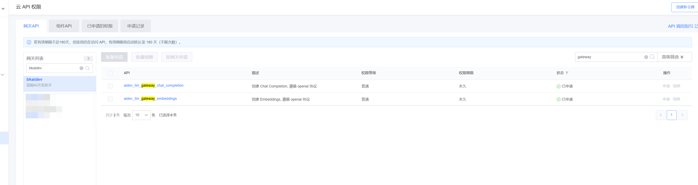
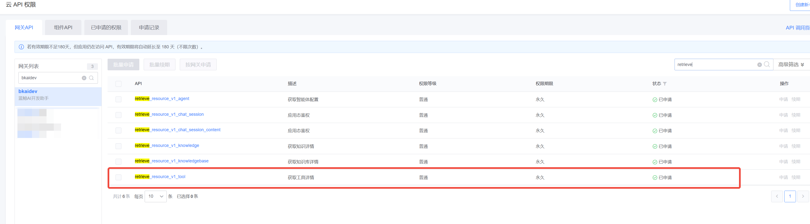
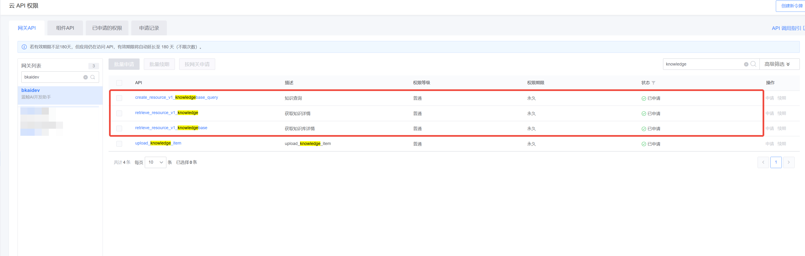

# aidev-agent sdk使用指南

## 概览

**当前版本**：1.0.0b44

### 支持的能力：

- 通用 Agent：支持基于任意模型进行知识抽取，工具执行，利用添加的工具和知识完成特定任务。
- 通用 Tool/FunctionCallAgent：在上述基础上，对支持 FunctionCall 的模型提供最佳支持。支持最新的 OpenAI Multi Tool 规范，可并发执行
  Function Call。

## 使用入门

### 1. 安装依赖

系统版本：Linux,MacOS
Python版本：>=3.10;

```
$ pip install aidev-agent==1.0.0b44
```

### 2. 使用样例

#### 2.1 使用前配置

使用前需要配置的一些环境变量,可以将下面配置写到`.env`中,下面是一些示例

```
# (必选)以下环境变量可以向aidev的服务的管理员获取
LLM_GW_ENDPOINT=https://xxx.example.com/prod/openapi/aidev/gateway/llm/v1
# 个人拥有的蓝鲸app应用名
APP_ID=xxx
BKPAAS_APP_ID=xxx
# 个人拥有的蓝鲸app应用密钥
APP_TOKEN=yyy
BKPAAS_APP_SECRET=yyy

# (可选)如果需要访问aidev平台资源,如知识库/工具,需要配置下面的环境变量
# 当前可访问的蓝鲸网关的模板名,可以在蓝鲸开发者平台中获取
BK_API_URL_TMPL=http://{api_name}.xxx.com
```

另外,至少需要申请以下`bkaidev`网关的权限,以访问`LLM Gateway`,参考下图



#### 样例1：调用 LLM Gateway 大模型服务

```python
from aidev_agent.core.extend.models.llm_gateway import ChatModel
model = ChatModel.get_setup_instance(model="hunyuan")
result = model.invoke("hi")
print(result)
```

#### 样例2：使用 CommonAgent 调用aidev平台上的工具

**注意** 使用前需要配置以下环境变量

```
# 当前可访问的蓝鲸网关的模板名,可以在蓝鲸开发者平台中获取,下面是示例
BK_API_URL_TMPL=http://{api_name}.xxx.com
```

另外,至少还需要申请下面的网关权限，才能完成样例



代码示例如下:

```python
from aidev_agent.api.bk_aidev import BKAidevApi
from aidev_agent.core.extend.agent.qa import CommonQAAgent
from aidev_agent.core.extend.models.llm_gateway import ChatModel

model_name = "hunyuan"
chat_model = ChatModel.get_setup_instance(
    model=model_name,
    streaming=True,
)

# 获取客户端对象
client = BKAidevApi.get_client_by_username(username="")
# 设置工具,使用aidev平台上的工具的 code
tool_codes = ["weather-query"]
tools = [client.construct_tool(tool_code) for tool_code in tool_codes]

agent_e, cfg = CommonQAAgent.get_agent_executor(
    chat_model,
    chat_model,
    extra_tools=tools,
)

# 测试部分
test_case_inputs = {"input": "今天深圳天气如何?"}
for each in agent_e.agent.stream_standard_event(agent_e, cfg, test_case_inputs):
    print(each)
```


#### 样例3：使用 CommonAgent 调用aidev平台的知识库

**注意** 使用前需要配置以下环境变量

```
# 当前可访问的蓝鲸网关的模板名,可以在蓝鲸开发者平台中获取,下面是示例
BK_API_URL_TMPL=http://{api_name}.xxx.com
```

另外,至少还需要申请下面的网关权限，才能完成样例



代码示例如下:

```python
from aidev_agent.api.bk_aidev import BKAidevApi
from aidev_agent.core.extend.agent.qa import CommonQAAgent
from aidev_agent.core.extend.models.llm_gateway import ChatModel

# 初始化模型和客户端
model_name = "hunyuan"
chat_model = ChatModel.get_setup_instance(
    model=model_name,
    streaming=True,
)
client = BKAidevApi.get_client_by_username(username="")
# 此处填入aidev平台上的知识库的 id
knowledge_bases = [client.api.appspace_retrieve_knowledgebase(path_params={"id": 1})["data"]]

agent_e, cfg = CommonQAAgent.get_agent_executor(
    chat_model,
    chat_model,
)

# 执行测试
test_case_inputs = {"input": "云桌面绿屏怎么办"}
results = []
for each in agent_e.agent.stream_standard_event(agent_e, cfg, test_case_inputs):
    if each == "data: [DONE]\n\n":
        break
    if each:
        chunk = json.loads(each[6:])
        results.append(chunk)

print(results)
```

# SSM 客户端使用指南
### 支持的能力：

- **用户态鉴权**：基于用户身份的权限验证，适用于用户操作场景
- **应用态鉴权**：基于应用身份的权限验证，适用于系统级操作
- **Django集成**：自动从request提取用户信息并选择合适的认证模式
- **Token缓存**：内置缓存机制，避免频繁请求，支持自动刷新

## 使用入门

### 1. 环境配置

使用前需要配置SSM相关的环境变量，可以将下面配置写到`.env`中：

```bash
# (必选)SSM服务端点 - 选择其一即可
BK_SSM_ENDPOINT=https://your-ssm-endpoint.com

# 或者分环境配置
BK_SSM_SG_ENDPOINT=https://bkssm.sg.example.com    # 生产环境
BK_SSM_BKOP_ENDPOINT=https://bkssm.bkop.example.com # 测试环境

# (必选)应用认证信息
BKPAAS_APP_ID=your_app_code
BKPAAS_APP_SECRET=your_app_secret
```

### 2. 使用样例
#### 样例1：应用态鉴权 - 系统级操作

```python
from aidev_agent.api.ssm_client import SSMClient
import requests

# 系统数据同步，使用应用态
client = SSMClient()
access_token = client.get_client_access_token()

# 调用外部API
headers = {'Authorization': f'Bearer {access_token}'}
response = requests.get('https://api.example.com/admin/sync', headers=headers)
print(response.json())
```

#### 样例2：用户态鉴权 - 用户操作

```python
from aidev_agent.api.ssm_client import SSMClient
import requests

# 获取特定用户的数据，使用用户态
username = "admin"
bk_token = "user_login_token"  # 从前端或其他渠道获取

client = SSMClient()
access_token = client.get_user_access_token(username, bk_token)

# 调用外部API
headers = {'Authorization': f'Bearer {access_token}'}
response = requests.get(f'https://api.example.com/users/{username}/data', headers=headers)
print(response.json())
```

#### 样例3：自动模式选择

```python
from aidev_agent.api.ssm_client import SSMClient
import requests

def get_llm_list(username: str = None, bk_token: str = None):
    """根据参数自动选择认证模式"""
    client = SSMClient()

    if username and bk_token:
        # 有用户信息 -> 用户态
        token = client.get_user_access_token(username, bk_token)
        api_url = f'https://api.example.com/users/{username}/llms'
    else:
        # 无用户信息 -> 应用态
        token = client.get_client_access_token()
        api_url = 'https://api.example.com/public/llms'

    headers = {'Authorization': f'Bearer {token}'}
    response = requests.get(api_url, headers=headers)
    return response.json()

# 用户态调用
user_llms = get_llm_list("admin", "user_bk_token")

# 应用态调用
public_llms = get_llm_list()
```

#### 样例4：Django视图集成

```python
from django.http import JsonResponse
from aidev_agent.api.ssm_client import SSMClient
import requests

def my_api_view(request):
    """手动从request提取用户信息并选择认证模式"""
    client = SSMClient()

    # 从request中提取用户信息
    username = getattr(request.user, 'username', None) if hasattr(request, 'user') else None
    bk_token = request.headers.get('X-Bk-Token') or request.META.get('HTTP_X_BK_TOKEN')

    if username and bk_token:
        # 用户态：有用户信息
        access_token = client.get_user_access_token(username, bk_token)
        api_url = f'https://api.example.com/users/{username}/resources'
        mode = 'user'
    else:
        # 应用态：无用户信息
        access_token = client.get_client_access_token()
        api_url = 'https://api.example.com/system/resources'
        mode = 'client'

    # 调用外部API
    headers = {'Authorization': f'Bearer {access_token}'}
    response = requests.get(api_url, headers=headers)

    return JsonResponse({
        'mode': mode,
        'data': response.json()
    })
```

#### 样例5：异常处理

```python
from aidev_agent.api.ssm_client import SSMClient, SSMException
import requests

def safe_api_call(username: str = None, bk_token: str = None):
    """带异常处理的API调用"""
    try:
        client = SSMClient()

        if username and bk_token:
            access_token = client.get_user_access_token(username, bk_token)
        else:
            access_token = client.get_client_access_token()

        headers = {'Authorization': f'Bearer {access_token}'}
        response = requests.get('https://api.example.com/data', headers=headers)
        response.raise_for_status()

        return {"success": True, "data": response.json()}

    except SSMException as e:
        print(f"SSM认证失败: {e}")
        return {"success": False, "error": "认证失败"}
    except requests.RequestException as e:
        print(f"API调用失败: {e}")
        return {"success": False, "error": "API调用失败"}
```

### 3. 核心API说明

| 方法 | 说明 | 使用场景 |
|------|------|----------|
| `SSMClient()` | 创建SSM客户端实例 | 所有场景的基础 |
| `client.get_client_access_token()` | 获取应用态token | 系统级操作、后台任务 |
| `client.get_user_access_token(username, bk_token)` | 获取用户态token | 用户操作、需要用户权限 |
| `client.verify_access_token(token)` | 验证token有效性 | token验证场景 |
| `client.clear_cache(username=None)` | 清理token缓存 | 缓存管理 |

### 4. 注意事项

1. **网络连接**: SSM服务只能直调，不能通过网关访问
2. **Token缓存**: 客户端会自动缓存token，避免频繁请求
3. **自动刷新**: token过期前会自动尝试刷新
4. **线程安全**: 支持多线程并发访问
5. **异常处理**: 建议捕获`SSMException`异常进行处理
